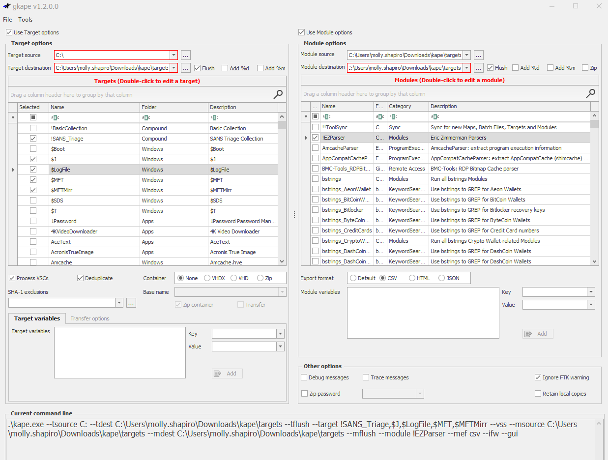

# Incident Response

## Lecture Notes: Incident Response

### What is an Incident?

* a violation or imminent threat of violation of computer security policies, acceptable use policies, or standard security practices
* adverse events that are computer security related, such as system crashes, packet floods, unauthorized use of system privileges, unauthorized access to sensitive data, and execution of malware that destroys data

### Incident Handling

* an action or plan for dealing with the misuse of computer systems and networks
* a coordinated and structured approach that goes from incident detection to resolution

### Goals of IR

* confirm whether or not an incident occurred
* provide rapid detection and containment
* determine and document the scope of the incident
* prevent a disjointed, non-cohesive response
* determine and promote facts and actual information
* minimize disruption to business and network operations
* minimize the damage to the compromised organization
* restore normal operations
* manage the public perception of the incident
* allow for criminal or civil actions against perpetrators
* educate senior management
* enhance the security posture of a compromised entity against further incidents

### Dwell Time

* the number of days from first evidence of compromise that an attacker is present on a victim network before detection
* median dwell time has gone from 16 days in 2022 to 10 days in 2023

### Motives

* nuisance
  * objective: access and propagation
  * example: botnets and spam
  * not targeted
  * often automated
* data theft
  * economic, political advantage
  * example: APTs
  * targeted
  * persistent
* cyber crime
  * objective: financial gain
  * example: credit card theft
  * targeted
  * frequently opportunistic
* hacktivism
  * objective: defamation, press and policy
  * example: website defacements
  * targeted
  * conspicuous
* destructive attack

### Attack Lifecycle

* initial recon
  * public profiles, job sites, DNS probing, public websites
* initial compromise
  * phishing
  * web browsing
* establish foothold
  * custom malware, keyloggers
* escalate privileges -> internal recon -> move laterally -> maintain presence
  * password cracking, application exploitation, dump password hashes, discover internal networks, plant backdoors, VPN subversion
* complete mission
  * steal/alter/destroy data, attack other networks

### IR Process

* preparation
* identification
* containment
* eradication
* recovery
* lessons learned

### IR Investigation Lifecycle

* initial leads start the process
* IOC creation -> deploy IOCs -> identify systems of interest -> collect evidence -> analyze data
  * iterative process

### IR Team Constituents

* core investigative team
* compliance
* legal
* HR
* network infrastructure
* business line managers
* desktop IT support

### Additional Notes

* M-trends report published by Mandiant discusses incident statistics
* most incident response today won't involve full disk imaging- it will be targeted acquisition instead

## Lecture Notes: IR Preparation

### Policy

* acceptable use policy
* security policy
* remote access policy
* Internet usage policy
* data usage policy
* outside "peer" notification policy
* example: warning banners when logging into systems

### Educating the User

* what to do when suspicious activity is seen
  * don't run your own investigation
  * notify IS and IT
  * keep it confidential
* what software can or cannot be installed
* what services should never be turned off
* basic phishing awareness

### Handling Communications and Data During an Incident

* treat all systems as potentially compromised
* for moving data from one system to another:
  * use an encrypted USB
  * avoid email or use encrypted email
  * if sending password protected attachments: do not send passwords in email
* use case numbers, do not refer to the case by name
* information dissemination on need to know basis only

### Tools

* hardware
  * forensic hardware- write-blockers, duplicators, bridges
  * media- blank disks
  * workstations
* software
  * triage/live forensics tools
  * disk imaging and analysis tools
  * artifact/log analysis
  * memory analysis
  * network packet capture and analysis

### Know Your Infrastructure

* how many systems?
  * servers
  * workstations
  * laptops
  * network appliances
* details
  * physical sites
  * roles
  * configurations
* is the inventory updated as systems are changed out?

### Network Diagrams

* segmentation and controls
  * traffic filtering
* network services
* proxies

### Access to Systems

* passwords
* crypto keys

### Additional Notes

* take notes- documentation
* prepare checklists of items to do, system builds, etc.
* establish war room, emergency communication plan
* reporting protocol and facilities
* establish point of contact for law enforcement agencies
* ongoing training and knowledge transfer between incident handlers

## Kape

<figure><figcaption></figcaption></figure>

* info:
  * kape vs. gcape: gcape is GUI version
  * Eric Zimmerman tool
  * can run from a USB
  * Sync with GitHub button in gkape will sync targets and modules with latest versions
  * used for targeted acquisition (you know what you're looking for)
* targets: where to acquire evidence from
  * targets are stored in \[kape directory]\Targets
    * .tkape files
    * can see where targets are located within files (what artifacts are where within the category of the tkape file, ex. Discord.tkape shows where Discord cache and local storage files are stored)
    * Windows: Windows artifacts
    * Apps: application artifacts
    * Compound: a set of targets stored in one .tkape file
      * ex. event logs, file system, evidence of execution, and more
      * points to other .tkape files
* container: where the output will be stored
  * if none is selected, the files will be stored just as they were obtained
* modules: uses existing tools and applies them to the acquired evidence
  * if source isn't defined, it will pull from the target destination (they should always be the same)
  * Eric Zimmerman parsers are under !EZParser
  * can output as CSV
  * select "Ignore FTK Warnings"
