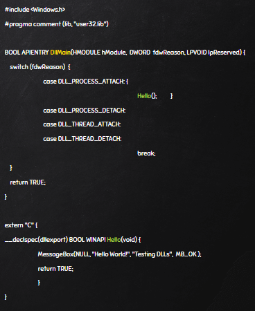
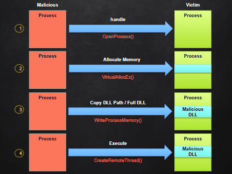

# Malware Techniques

## Lecture Notes: Malware Persistence Mechanisms

### What is a DLL?

<figure><figcaption>
calling and utilizing a DLL
</figcaption></figure>

* dynamic link library
* a library that contains code and data that can be used by more than one program at the same time- Microsoft
* PE file format
  * one bit is different than EXEs (is\_DLL)
* used to export/import libraries and functions for programs to extend their capabilities
* can attach DLLs to processes and threads
  * can also specify what happens when detaching the DLLS from processes and threads
  * DLL\_PROCESS\_ATTACH: what happens when you attach the DLL to the process
* when a DLL is called specifically (as seen in the above image), it allows for our PE tools (like CFF Explorer) to see the imports named properly

### DLL Injection

* normal
  * Windows loader is used to load DLL and its imports
    * [LoadLibrary()](pe-files.md#packed-executables)
      * Kernel32.dll
  * DLL is officially registered and can be seen easily in Process Explorer/Process Hacker
  * threat actors often don't use this because they are pulling libraries from elsewhere (the malicious EXE being used, a remote location, etc.)
  * ex. you load kernel32.dll into memory with LoadLibrary-> you want to call CreateProcess -> you use GetProcAddress to locate where CreateProcess is in memory
* API(s) used
  * [GetProcAddress](pe-files.md#packed-executables) -> find LoadLibrary's address
    * Kernel32.dll
  * VirtualAlloc(Ex)
    * locates some space (in an amount defined by the dev) in memory to allocate for the process
    * VirtualAllocEx is used for remote processes (ex. process A is loading process B)
    * usually uses the Windows Memory Manager to find unallocated space, which means that there won't be a conflict between legitimate code in memory and the injected code
  * WriteProcessMemory
  * CreateRemoteThread
    * addr of LoadLibrary
    * Path2DLL
    * used to trigger remote library
* example of benign use: browser extensions being injected to add functionality to your browser

### How Injection Works

<figure><figcaption></figcaption></figure>

* getting the handle of a process is how you access it
  * OpenProcess opens access to the process (not running it)
* allocates memory space in the victim process with VirtualAllocEx() and gets privileges
  * if trying to access a victim process with higher processes, it may be denied
    * must have the same or higher privileges
* WriteProcessMemory() with DLL path to copy the malicious DLL into the victim process (can also load the full DLL)
* execute the malicious DLL in the victim process with CreateRemoteThread()

#### Steps

* step 1: open handle to target process
* step 2: allocate memory to store file path (SeDebug privilege required)
* step 3: find kernel32.LoadLibrary function address
* step 4: use one of several remote thread creation APIs (like CreateRemoteThreadEx) to load DLL into target process's memory space
  * creates new thread and executes LoadLibrary to load DLL
* DLL now runs in target process

### Persistence and Avoiding Detection

* threat actors may target explorer.exe and svchost.exe
  * must have high enough perms
* self-injection
  * the process itself injects itself with other code and overwrites

## Lab Notes: Call for Help

* change default web browser to Google Chrome
* sample deletes running instances of tools like Wireshark, ProcMon, and ProcExp
* three options:
  * use new tools
  * copy tools to new file locations and rename them
  * patching
* patching
  * open sample with 010 Editor
  * search for "procmon" as text
  * change instances of tools in the file
  * modify as 90- no operation
* API Monitor
  * API Filter Window
    * Find
      * can search for functions as seen in CFF Explorer
  * can save settings so you don't have to reconfigure
  * Monitor New Process -> select process file
    * won't accurately pick up elevation if it was run as admin, since API Monitor is already admin

## Additional Notes

* malware that interacts with existing processes needs to use CreateToolhelp32Snapshot because it takes snapshots of running processes
  * start with Process32First, then Process32Next
    * starts at the first process- if not the right one, moves on
* letters in function names
  * A in a function name indicates ACSII/ANSI
    * 1 byte
  * W in a function name indicates wide characters
    * multiple bytes
  * neither in a function name means that the system will use whichever is needed
* CreateToolhelp32Snapshot
  * handle value is then used when Process32First is called right after
* Process32First/Next
  * can expand LPPROCESSENTRY to see process name
* CreateFileA creating a DLL- why is a file creating a library in C:\Windows\System32? a legitimate program would most likely create a program in Program Files
* SetTime function- can copy time from a legitimate file and change the file timestamps to that same timestamp to have it blend in
