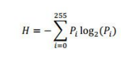

# PE Files

## Lecture Notes: PE File Format

* portable executable
* executable/compiled code file format used by Microsoft Windows
  * the reason why an EXE compiled on one version of Windows works on another too
* typical extensions
  * EXE, DLL
    * the difference between an EXE and DLL is technically 1 bit
  * OCX (ActiveX control)
  * CPL (control panel controls)
  * MUI (multilingual user interface)
  * DRV (device driver)

### File Structure

* consists of headers and sections
  * headers
    * DOS header
    * PE header
    * optional header
    * data directories
    * sections table
  * sections
    * code
    * imports
    * data

### Headers

* start of the DOS header is 4D 5A (MZ)
  * "This program cannot be run in DOS mode"- if the program has a GUI that has a component that can't be run in DOS mode
* start of the NT/PE header is always 50 45 (PE)
* DOS header and stub are legacy, but required
* NT header information (offset, size allocated, value, and description for each) has:
  * machine
  * number of sections
  * timestamp
    * Unix big endian
    * when the code was compiled
  * pointer to symbol table
  * number of tables
  * size of optional header
  * characteristics
    * flags that specify 32 or 64 bit, EXE/DLL, etc.
    * bit vector: used when there are multiple flags and you want each bit to represent a flag
      * each bit corresponds to a characteristic (ex. file is executable- 1 means yes, 0 means no)
* optional header (not actually optional) has:
  * magic (file header determination)
  * address of entry point
    * once everything is loaded, where to start running the code in the program
    * normally pointing to a .text section- should investigate if not
  * image base
    * what memory address the system should start loading the image from
    * will be 4 bytes for a 32 bit program and 8 bytes for a 64 bit program
    * modern image randomization means that this changes every time a program is run
  * section alignment
  * file alignment
  * data directories
    * export directory RVA and size
    * import directory RVA and size
    * etc.
    * RVA- relative virtual address
      * address relative to the image base
      * image base + virtual address = RVA
    * if RVA and size are 0, then the directory doesn't exist
    * libraries have export directories- APIs for other programs to use need to be exported
      * could also have import directories because they may depend on other libraries
    * executables have import directories- they always depend on other libraries
      * could also have export directories- NOT BEST PRACTICE, SUSPICIOUS
  * major and minor OS versions
    * major is ones place (ex. 0004 is 4)
    * minor is tens place (ex. 0000 is .0)
    * reference online list of Windows versions
  * subsystem
    * ex. Windows console or GUI
    * modifying this might corrupt the program

### Sections

* sections are defined in the section table
  * name, offset, size, flags
    * .text section usually includes code
    * .rdata is read only data
    * .data is read/write data
    * .rsrc is for resources
    * flags include if the section is shareable, executable, readable, writeable, contains code, etc.
  * both raw/real (in file) and virtual (in memory) offsets and sizes are provided
    * raw offset (on disk)- start at 0
    * virtual offset- start at image base
    * on disk, files are compressed, and then when they are sent to memory, they are decompressed
      * if raw size is 0 and virtual size is larger, SUSPICIOUS
* static values (ex. variables that don't change) are put in read-only sections
* functions being executed need to be put in sections that can be read and executed
* dynamic values (ex. variables that do change) are put in read and write sections
* if sections are \_\_, then they are suspicious- may be injection

### Additional Notes

* every program thinks it is the only program running on the program
* systems cannot read just 1 byte- it can only read in sectors (512 bytes, or 200 in hex)
  * if a one-byte file is created, it will be stored in a sector with 511 bytes of random
  * if another one-byte file is created, it will be stored on a new sector with another 511 bytes of random
  * this is called file alignment
  * in memory, the alignment is based on page files (4KB, or 1000 in hex)
    * therefore each section will be increments of 0x1000 apart, even if each section isn't that big

### DLLs

* DLLs are shared code that can be either statically or dynamically linked to an EXE file
* DLLs help promote modularization of code, code reuse, efficient memory usage, and reduced disk space
* when referencing functions in a library, the code must include both the address of the library and the address of the function within the library
  * mapped at run time- not fixed, because we don't know where the image base is yet

### Imported DLLs and Functions

* import directories show what libraries are being imported/referenced
  * within each library you can see what APIs are being referenced (not how many APIs there are total in the library)
* statically linked libraries: necessary libraries are copied and compiled into the executable
* dynamically linked libraries: necessary libraries are referenced within the compiled executable so they can be pulled from the host
  * this is why the import section exists
  * system checks in memory- if running in memory, gets the memory address
    * if not, system checks in disk and loads it
    * if the library doesn't exist, there should be an error message and the program can't run
  * usually has a function like LoadLibrary(DLL name)
    * DLL name isn't always listed in the function- not explicit
* malware developers will add in random libraries to divert investigators
* import/export directories can be hidden

### Common Windows DLLs (usermode)

* kernel32.dll
* user32.dll
* advapi32.dll
  * Windows Registry-related
* gdi32.dll
  * graphical interface-related
* shell32.dll
  * shell-related
* these are core Windows DLLs that are present on every machine


Common libraries and their uses


### Launching an EXE

* Windows Loader reads the EXE header info
  * gets ImageBase, EntryPoint, and other info
* section table is read
  * gets number of sections, RVA, and size of sections
* load sections into virtual memory starting at ImageBase
* read import directory
  * load libraries referenced
  * link to functions in DLLs
* jump to EntryPoint and begin execution

### Dependency Walker

* can see what libraries are called within other libraries

## Lecture Notes: PE File Analysis

### Static Analysis

* analysis without executing the code
* calculate hash to compare
* examine PE structure
  * compile/link timestamps
  * compiler/linker type
  * DLL exports/imports and functions
  * section names and flags
  * resources
* string search
* entropy

### Raw String Search

* strings are objects that represent sequences of characters
* formats:
  * ASCII (1 byte)
  * Unicode (2 bytes)
* Sysinternals strings tool
  * retrieves all ASCII and Unicode strings (>3 char) by default
  * many options available

### Packed Executables

* packing is the process of encrypting, obfuscating, and/or compressing content in a PE file
* hiding an executable in a "wrapper" of another file
  * kind of similar to compression- you see the zip file/container, and you have to unzip/unpack it to see what files are inside
  * can be packed multiple times- Russian doll style
* thwarts static analysis
* strings are not visible
  * will only see information about the wrapper program
* original imports are not visible
  * packed programs typically have far fewer imports than normal
  * packed programs always import:
    * LoadLibraryA- loads the specified DLL into memory
    * GetProcAddress- retrieves the address for specific exported function from DLL
    * GetModuleHandleA- gets a handle to loaded DLL
* a packed program uses its own code to dynamically link DLLs instead of using the Windows Loader
* if the program is run, it will be unpacked and run in memory, and a memory dump will reveal the unpacked file

### Detecting a Packed EXE

* unusual section names and tags
  * ABC
  * UPX
  * TEH
* size of raw data sections on disk is 0 vs size in memory is larger
* permissions
  * .text sections are read and execute
  * .data sections are read/write
  * .rdata sections are read
  * read/write/execute perms are very strange
* very few imports
* less strings/obfuscated strings
* high entropy

### Entropy

<figure><figcaption><p>Shannon theorem</p></figcaption></figure>

* a measurement of randomness in data
  * if data is readable, its entropy will be very low
  * if data is encrypted or compressed, its entropy will be high
* calculated using the Shannon theorem
* expressed as a number between 0-8
  * 0 = least random
  * 8 = most random
    * no such thing as actually reaching 8 because you can't reach 100% probability
* packed/compressed data is more random
  * this isn't a perfect indicator of packing
* tools like Detect It Easy can calculate entropy

## Lab Notes: PE File Information

### CFF Explorer

* can drag and drop EXEs
* not great with timestamps- modified time is most reliable when trying to determine compile date and time
* original file name may be available in Resource Editor
  * can also use the Resource Hacker tool
  * threat actors often hide malicious code in the resource section (ex. droppers)
* can see import and export directories

## Lab Notes: Packing Executables

### UPX

```
upx -o [packed executable name] [original executable name]
```

### DIE

* Load file -> Strings -> Search
  * searches for crypto functions
  * crypto functions don't necessarily mean something harmful- could be using private keys (ex. PuTTY) but could be an indicator of packing
